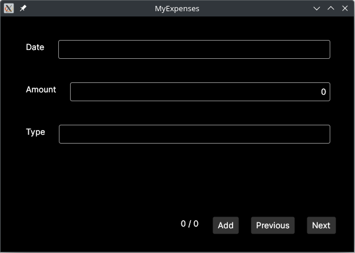
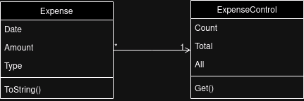

# MyExpenses

This is a project (aiming at education) that shows a complete app that allows to manage expenses. The core package holds **Expense** (an individual expense), and **ExpenseControl** (holding a collection of expenses).



## Design

The core package holds **Expense** (an individual expense), and **ExpenseControl** (holding a collection of expenses).



## Building

This project has been developed with *IntelliJ Rider*, though it is simply possible to build and run the project (provided the `dotnet SDK` is installed):

```bash
$ cd MyExpenses
$ dotnet run
```
